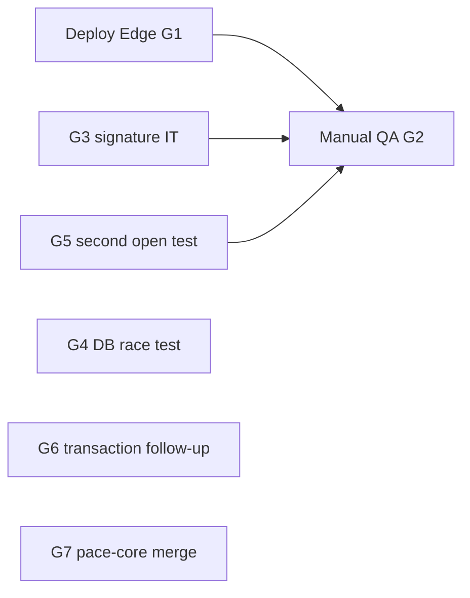

# PUMP-06 remediation plan

Authority: [PU06-webhooks-delivery-pipeline-requirements.md](../requirements/PU06-webhooks-delivery-pipeline-requirements.md)

Tracking: [PUMP-06-acceptance-status.md](PUMP-06-acceptance-status.md)

## Closed in this delivery

- Edge handler `handleWebhook` + `pump-webhook-logic.ts` (BR-N1, BR-D1–D3, BR-Precedence, BR-Suppression, BR-A12, BR-N2, BR-D-NoMatch logging)
- pace-pump2 §13 unit/contract suites (9/9 items; items 3 and 8 partial — see below)
- `npm run validate` PASS on `cursor/7d3896e4`

## Open gaps (ordered)

### G1 — Deploy updated Edge to dev-db (blocks §11 / §15 / §12)

**Requirement:** §15, §12, §11 live evidence on `pump-webhook/{gateway}`.

**Current state:** Backend-ready report confirms slug ACTIVE (`verify_jwt: false`) on `yihzsfcceciimdoiibif`, but runtime may predate commit `511a33a`.

**Remediation:**

1. Merge and release pace-core2 `cursor/7d3896e4` (or cherry-pick `pump-webhook-logic.ts` + `pump-edge.ts` webhook section).
2. `supabase functions deploy pump-webhook` against `yihzsfcceciimdoiibif`.
3. Confirm `list_edge_functions` version/slug updated.

**Owner:** Platform / pace-core2 deploy lane.

### G2 — §12 manual QA pack execution

**Requirement:** §12 steps 1–18.

**Remediation:**

1. Use [PUMP-06-qa-pack.md](../test-packs/PUMP-06-qa-pack.md).
2. Seed `pump_message_recipient.gateway_message_id` via `pump-send` (PUMP-05/07) for test addresses.
3. Record pass/fail in acceptance status §12 table.
4. Mark build queue `manual QA` complete when signed off.

**Owner:** Operator / integration reviewer.

### G3 — §13.8 Signature-failure HTTP integration test

**Requirement:** Tampered signature → 401, zero DB writes.

**Current state:** `pumpWebhookHandler.contract.test.ts` asserts source order only.

**Remediation (pick one):**

- **A (preferred):** Export `verifyResendSignature` / `verifyTwilioSignature` behind injectable secrets in test harness; POST mock `Request` to `handleWebhook` with Deno test runner in pace-core2.
- **B (lighter):** Vitest integration test with mocked `loadGatewayConfig` + known secret, compute invalid Svix signature, assert 401 and mocked DB never called.

**Estimate:** Small (1 test file in pace-core2 or pace-pump2).

### G4 — §13.3 Concurrent race against real UNIQUE constraint

**Requirement:** Two parallel requests, one INSERT, one duplicate at DB layer.

**Current state:** `pumpWebhookIdempotency.test.ts` uses in-memory `Set`.

**Remediation:** Optional integration test against local Supabase or dev-db fixture table with `(gateway, dedupe_key)` UNIQUE — run in CI only when `SUPABASE_SERVICE_ROLE_KEY` present (same pattern as PUMP-03 integration skip).

**Priority:** Low (logic + UNIQUE handling already coded).

### G5 — AC-06B-10 second `email.opened` delivery-event row

**Requirement:** Second open with different `svix-id` inserts second `pump_delivery_event`, does not change `opened_at`.

**Current state:** Engagement tests cover patch only, not two-phase orchestration.

**Remediation:** Extend `pumpWebhookIdempotency.test.ts` or new test: mock deps with two distinct dedupe keys, assert `insertDeliveryEvent` called twice, `updateRecipient` once.

**Estimate:** Small.

### G6 — AC-06X-18 partial audit row on apply failure

**Requirement:** §11 AC-18 — no partial state in recipient/suppression; implies safe retry.

**Current state:** INSERT succeeds, then UPDATE/UPSERT may throw → 500; `pump_delivery_event` row remains (recipient/suppression unchanged).

**Remediation options:**

- **v1 accept:** Document as known limitation; provider retry dedupes event row, apply may run on replay if status still allows.
- **v2:** Wrap INSERT + apply in Postgres RPC transaction (out of slice scope).

**Priority:** Low unless operator reports stuck rows.

### G7 — pace-core2 package link for consuming apps

**Requirement:** pace-pump2 `file:../pace-core2` must resolve committed webhook logic for other clones.

**Remediation:** Merge pace-core2 PR; tag or bump `@solvera/pace-core` if published; document in build queue Evidence.

### G8 — Requirements doc metadata drift (non-blocking)

**Requirement:** PU06 §1 Status / §15 “Edge not deployed” vs backend-ready PASS.

**Remediation:** Update slice Status to `Built (pending §12)` and §17 build-prerequisite note when PR merges — editorial only.

## Suggested execution order

1. G7 + G1 (merge + deploy)
2. G3 + G5 (quick test gaps)
3. G2 (manual sign-off)
4. G4, G6 as backlog

## Done when

- All §12 steps marked Pass in [PUMP-06-acceptance-status.md](PUMP-06-acceptance-status.md)
- Build queue PUMP-06 row `built` with no open blockers except documented deferrals (G6)
